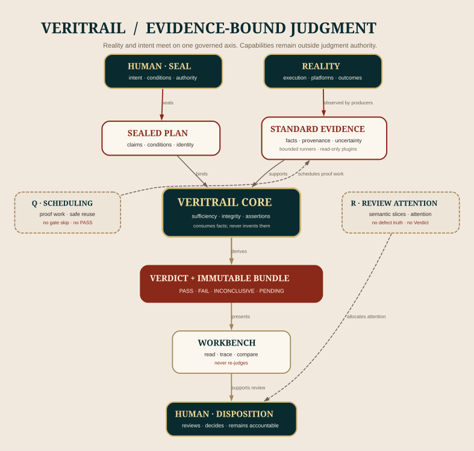

# VeriTrail / 验迹

[](https://github.com/NoctilumeDev/VeriTrail/actions/workflows/ci.yml) [](https://github.com/NoctilumeDev/VeriTrail/actions/workflows/browser-smoke.yml) [](https://github.com/NoctilumeDev/VeriTrail/actions/workflows/ci.yml) [](https://github.com/NoctilumeDev/VeriTrail/releases/tag/v0.13.0) [](https://github.com/NoctilumeDev/VeriTrail/releases/tag/github-evidence-v0.1.0) [](LICENSE)

> **让每一项结论，都沿证据中轴归位。**
>
> A local-first workbench for evidence-bound, reproducible verification.

VeriTrail（验迹）把事先封存的验收条件、来自真实执行或外部平台的证据，以及确定性裁决分开保存。
它帮助独立开发者和小型团队回答：**这次到底证明了什么，依据是什么，边界在哪里，失败应回到哪一层排查。**

[开始使用](#开始使用) · [理解系统](#十秒认识-veritrail) · [查看状态](#当前状态) ·
[阅读文档](#阅读路径) · [完整里程碑](docs/milestones.md)

## 十秒认识 VeriTrail

VeriTrail 的核心关系很小：



<p align="center"><sub>中轴实线是证据与裁决链，两翼虚线是可替换的辅助能力；图中两端的 Human authority 属于同一权威域。</sub></p>

这不是一条把所有能力串成单体流水线的图。Core 只消费 sealed Plan 与标准 Evidence；R 面向人的审查
注意力，Q 面向证明义务的执行效率，两者都不能获得 Core Verdict 权。Workbench 负责展示和验真，
不在浏览器里重新裁决。

| 责任 | 谁拥有 | 明确不拥有 |
| --- | --- | --- |
| 前提、目标与 Seal 决定 | Human authority | 世界终极真相 |
| 事实采集与来源说明 | Evidence producer / plugin | 验收标准与 Verdict |
| 证据充分性与确定性裁决 | VeriTrail Core | 外部事实、执行资源与人工处置 |
| 最终处置 | Human authority | 改写历史 Evidence 或伪造确定性 |

> **现实拥有真相，VeriTrail 只拥有裁决纪律。**

## 系统分层

各层通过版本化合同和不可变 Artifact 组合；依赖不等于 ownership，消费也不等于继承状态机。

| 层 | 回答的问题 | 主要产物 | 当前边界 |
| --- | --- | --- | --- |
| Entry / Authoring | 怎样更容易起草一个可检查的计划？ | `DRAFT / NOT_SEALED` Plan | Starter 与 Authoring Skill 不 Seal、不运行、不裁决 |
| Evidence | 真实执行或外部平台观察到了什么？ | 标准 Evidence + provenance | Producer 只报告事实，不能输出 Verdict-like 结论 |
| Core | 给定 Plan 与 Evidence，条件是否满足？ | `PASS / FAIL / INCONCLUSIVE / PENDING` + Bundle | 只使用版本化规则，不拥有世界真相 |
| Workbench | 人怎样读懂并复核这些 Artifact？ | 本地只读视图 | 不写回、不重新裁决 |
| Review Attention / R | 人应该优先看哪些源码关系与切片？ | Review Artifact / Attention Proposal | SourceSnapshot 与 Derivation Input Binding 合同已冻结；Input Binding 实现尚未开始 |
| Verification Scheduling / Q | 既定证明义务怎样减少无效重算？ | 候选 Schedule / Evidence reuse binding | Q0 仅冻结蓝图，尚无实现，也无 Gate 跳过权 |


<p align="center"><sub>Workbench 是证据的只读阅读面；宫阙视觉语言不改变任何裁决语义。</sub></p>

## 当前状态

下表刻意把“已经公开交付”“合同已冻结”和“只在设计空间”分开，避免把路线图当成实现证据。

| 轨道 / 产品 | 职责 | 当前事实 |
| --- | --- | --- |
| Core / M | 计划、证据、运行、裁决与不可变 Bundle | `v0.13.0 RELEASED / MAINTENANCE_FROZEN`；M0–M14 已冻结 |
| Entry / E | Starter 与 Authoring Skill | `0.2.0 RELEASED`；只生成并校验草案 |
| Platform / P | GitHub API 与 Public Render Evidence | `P4_GITHUB_EVIDENCE_0.1.0_RELEASED / P4_FROZEN` |
| Review / R | 确定性源码事实、语义切片与未来注意力提案 | `R1_SOURCE_SNAPSHOT_FROZEN / R1_DERIVATION_INPUT_BINDING_CONTRACT_FROZEN / R1_DERIVATION_INPUT_IMPLEMENTATION_ALLOWED / R1_DERIVATION_INPUT_IMPLEMENTATION_NOT_STARTED / R1_FACT_RELATION_SLICE_COVERAGE_IMPLEMENTATION_NOT_STARTED` |
| Quick / Q | 验证调度与 Evidence 安全复用的候选边界 | `Q0_BLUEPRINT_FROZEN / Q_IMPLEMENTATION_NOT_STARTED / NO_GATE_SKIP_AUTHORITY` |

完整状态、不可移动坐标和保留失败由[里程碑与文档索引](docs/milestones.md)保存。能力边界、候选触发条件
以及 VeriTrail、JPyxis、FlowKernel 与 Human authority 的关系另见
[能力边界与系统认知地图](docs/114-capability-boundary-and-system-map.md)。

## 选择入口

| 我现在要做什么 | 从这里进入 | 你会得到什么 |
| --- | --- | --- |
| 十分钟认识验迹 | [从这里开始](START_HERE.md) | 同一预注册标准下的一次真实 `PASS` 和一次故意 `FAIL` |
| 接入一个本地 Web 项目 | [Starter 0.2.0](https://github.com/NoctilumeDev/VeriTrail/releases/tag/starter-v0.2.0) | 有界 `single-webapp` / `static-site` 草案；保持 `DRAFT / NOT SEALED` |
| 用 AI 协助填写合同 | [Authoring Skill 0.2.0](https://github.com/NoctilumeDev/VeriTrail/releases/tag/authoring-skill-v0.2.0) | 有限 Preset 识别、缺失信息追问和候选草案；不封存、不裁决 |
| 直接使用稳定内核 | [Core 0.13.0](https://github.com/NoctilumeDev/VeriTrail/releases/tag/v0.13.0) | Plan、Evidence、四 Verdict、Acceptance Bundle、合成首跑与本地只读 Workbench |
| 采集公开 GitHub 事实 | [GitHub Evidence Plugin 0.1.0](https://github.com/NoctilumeDev/VeriTrail/releases/tag/github-evidence-v0.1.0) | 只读 API / Public Render Evidence 与 Core handoff |

## 它解决什么

工程项目很容易把局部绿灯误当成整体完成：单元测试通过，但真实浏览器存在失败请求；单实例正常，
多实例出现重复副作用；一次压测写着“并发 1000”，却没有说明总请求、同时在途、RPS 或热点竞争数。

VeriTrail 不替代测试框架、CI、浏览器或监控。它在这些工具之上建立一条可复算的验收链：

```text
sealed Plan / Profile
  -> resource and environment preflight
  -> bounded target lifecycle
  -> structured Evidence collection
  -> deterministic Core evaluation
  -> immutable Bundle and Catalog
  -> comparison / paired / batch analysis where applicable
  -> owned cleanup and residual verification
```

核心方法只有五条：冻结基线；一次只改变一个主要变量；用显式组合矩阵验证交互；用固定种子寻找并
复现偶发问题；最后用真实链路验证系统结论。资源限制可以停止升压，但不能降低一致性与安全不变量。

## 结论语言

运行是否结束和证据能否支持结论是两件事，因此必须分开保存：

| Dimension | Values | Meaning |
| --- | --- | --- |
| ExecutionStatus | `PLANNED / RUNNING / COMPLETED / ABORTED / ERROR` | 实验是否完整执行 |
| Verdict | `PASS / FAIL / INCONCLUSIVE / PENDING` | 当前证据能否支持判断 |

- `PASS`：适用证据齐全，硬性不变量成立；
- `FAIL`：至少一个硬性不变量被可复现证据否定；
- `INCONCLUSIVE`：变量污染、环境漂移或证据冲突导致无法归因；
- `PENDING`：尚未取得计划要求的真实证据；
- `ABORTED` 是运行状态。资源停止线触发时保存现场，不伪造 `PASS / FAIL`。

## 开始使用

第一次接触请优先走 [START_HERE](START_HERE.md) 的十分钟 PASS / 故意 FAIL 黄金路径。下面是源码
工作区的最小 Core 入口；浏览器采集和 Windows 受控进程能力保持可选安装。

```powershell
python -m venv .venv
.\.venv\Scripts\python.exe -m pip install --upgrade pip
.\.venv\Scripts\python.exe -m pip install --editable ".[browser,command-windows]"
.\.venv\Scripts\python.exe -m playwright install chromium
```

封存一个最小计划并计算 Run：

```powershell
.\.venv\Scripts\veritrail.exe seal `
  --plan examples\minimal\plan.json `
  --output artifacts\m0-sealed-plan.json

.\.venv\Scripts\veritrail.exe evaluate `
  --plan artifacts\m0-sealed-plan.json `
  --evidence examples\minimal\evidence-pass.json `
  --run-id my-first-run `
  --output artifacts\my-first-run
```

开发者需要复现 Public CI、Starter、Authoring Skill、Workbench 或发布资产时，请按
[贡献指南](CONTRIBUTING.md)和[里程碑索引](docs/milestones.md)中的对应合同运行完整矩阵；首页不复制整套
发布门禁命令。

## 已交付能力与边界

Core 的 M0–M14 已形成单机可验证闭环，覆盖 sealed Plan、资源预检、真实 Chromium Evidence、只读
Workbench、不可变 Catalog、同计划比较、四角色配对、批次矩阵、可信有界命令、完整项目自举、真实
项目链路与最终发布。每项能力只对其冻结合同中的环境、拓扑与威胁边界成立。

<details>
<summary><strong>展开 M0–M14 能力索引</strong></summary>

| Milestone | Capability | Status |
| --- | --- | --- |
| M0 | 封存计划、证据导入与确定性裁决 | `FROZEN` |
| M1 | 启动前资源与环境预检 | `FROZEN` |
| M2 | 有界真实 Chromium 证据 | `FROZEN` |
| M3 | 只读 Vue 证据工作台 | `FROZEN` |
| M4 | 本地 Run Catalog 与轻量自举 | `FROZEN` |
| M5 | 有界运行编排与静态目标生命周期 | `FROZEN` |
| M6 | 同计划复跑确定性比较 | `FROZEN` |
| M7 | 预注册四角色配对反事实分析 | `FROZEN` |
| M8 | 全因子批次矩阵与固定种子扰动 | `FROZEN` |
| M9 | 受控项目命令执行 | `FROZEN` |
| M10 | 有界完整项目自举 | `FROZEN` |
| M11 | 真实项目功能全链路 | `FROZEN` |
| M12 | Palace Evidence Workbench | `FROZEN` |
| M13 | 系统与分层代码质量终审 | `FROZEN` |
| M14 | 整改后终局复验与发布收束 | `FROZEN / RELEASED` |

</details>

平台插件与后继研究轨保持独立：

- GitHub Evidence Plugin `0.1.0` 已完成 P0–P4 的合同、Structured API、匿名 Public Render、同一
  Evidence snapshot handoff、公开资产与下载读回；插件只观察 GitHub，不成为新的事实中心。
- Review Attention 已冻结 R0、首个 Pattern Corpus 与 R1 合同。R1 首版只针对 Python 3.10 结构语义，
  不外推成整个多语言仓库已经被理解；[payload 前置审计](docs/123-r1-schema-payload-preflight-correction.md)
  在零改动施工前发现并补齐 item key、frontier、Coverage 与 provenance identity 缺口，
  [重新冻结发布](docs/124-r1-schema-payload-preflight-refreeze-publication.md)完成后只允许从新 exact main
  起草版本化 Schema、纯数据兼容 corpus 与规范摘要向量。[payload 候选](docs/125-r1-schema-payload-freeze-candidate.md)
  已经物化这些资产；其远端门、主线合入、exact-main 门与匿名读回由
  [冻结发布](docs/126-r1-schema-payload-freeze-publication.md)外部绑定。最后门成立后只解除独立运行实现合同
  或首个最小切片的入口。[SourceSnapshot 运行合同](docs/127-r1-source-snapshot-runtime-contract.md)已在
  写代码前拆开单 Artifact 与 Derivation Manifest、acquisition safety budget 与后继 Policy budget；其
  [冻结发布](docs/128-r1-source-snapshot-runtime-contract-freeze-publication.md)完成最后门后，只解除该最小
  实现入口。[SourceSnapshot 实现候选](docs/129-r1-source-snapshot-implementation-freeze-candidate.md)
  已从 exact Git object 建立 raw-path inventory、规范摘要与单文件 create-new publication；其
  [冻结发布](docs/130-r1-source-snapshot-freeze-publication.md)完成独立门禁与公开读回。当前只冻结这一
  最小运行切片。[后继最小闭环审计](docs/131-r1-post-snapshot-derivation-input-audit.md)进一步确认 FactSet
  不能脱离 DerivationEvidence 与完整 Manifest 单独发布，因此选择不产生新 Artifact 的
  [Derivation Input Binding 合同](docs/132-r1-derivation-input-binding-contract.md)。其
  [冻结发布](docs/133-r1-derivation-input-binding-contract-freeze-publication.md)完成候选门禁、受保护主线、
  exact-main 门与匿名读回后，只解除这一窄边界的实现停止线。Input Binding 实现尚未开始；parser、Facts、
  Relations、Slices、Coverage 与完整 Derivation Manifest 仍未启动。
- Q0 只冻结 Verification Scheduling 的身份与权威边界。Q 缺失或卸载时必须退回完整串行验证，
  Verification semantics 不得变化。

## 公开证据与安全边界

`Public CI` 和 `Browser Smoke` 提供平台对齐、双 Python、构建、真实 Chromium 与公开资产读回的快速
基线。它们不能替代物理键盘、完整真实项目、受控宿主机资源停止线或清理读回；GitHub 绿灯不自动等于
整个里程碑 `PASS`。

VeriTrail 的安全边界同样是有界的：

- 默认只接受显式回环目标，不读取浏览器 Profile，不持久化 Cookie、Authorization 或响应正文；
- Plan、Evidence、报告与附件通过规范化 JSON、清单和 SHA-256 建立可复核关系；
- M9/M10 只运行结构化、经预览摘要批准的可信本地命令，不接受 Shell 字符串；
- Windows Job Object、listener owner 与资源上限限制误杀和残留，但不构成恶意代码沙箱；
- AI 可以提出关注候选、解释异常或建议补证，不能确认缺陷真值，也不能决定 `PASS / FAIL`。

## 信任与认识论上限

VeriTrail 擅长发现封存坐标之后的漂移、错绑、漏证据与规则不一致；它不能仅凭一条内部自洽的证据链
证明最初事实真实，也不能裁定提出者的观点在终极意义上正确。

```text
Consistency != Authenticity != Truth
Verification Correctness != Specification Correctness
Not responsible for Truth != Not responsible for Uncertainty
```

现实若模糊、不完整、冲突或不可判，系统必须保留这种不确定性。精确边界见
[产品定义](docs/00-product-brief.md)与[GitHub Evidence Plugin 合同](docs/78-github-evidence-plugin-contract.md)。
简单说：**它防的是漂移，不是阴谋；它负责的是裁决秩序，不是真理本身。**

## 系统家族与未来边界

VeriTrail 不是把所有能力都吸进 Core 的“超级平台”。跨系统关系应通过稳定合同、不可变 Artifact 和
可替换 adapter 建立：

| 系统 / 轨道 | 负责 | 关系状态 |
| --- | --- | --- |
| [JPyxis](https://github.com/NoctilumeDev/JPyxis) | 异构计算中的控制、定义与运行时分权 | 独立系统；未来可通过 execution receipt / Evidence adapter 对接 |
| [FlowKernel](https://github.com/NoctilumeDev/FlowKernel) | 不可靠策略与确定性权限、资源、隔离边界 | 独立 Planned 仓库；不是当前可运行依赖 |
| Platform / P | 观察外部平台事实 | 已有 GitHub 0.1.0；其他平台仍是候选 |
| Review / R | 压缩人的代码审查注意力 | SourceSnapshot 与 Derivation Input Binding 合同冻结；后继实现未开始 |
| Quick / Q | 优化证明义务的 wall-clock 与重算 | Q0 蓝图冻结；实现未开始 |

这些关系是认知地图，不是当前集成声明。一个独立系统最多通过不可变 Artifact / Evidence adapter 接入
VeriTrail；事件可以跨界，状态所有权、执行入口、凭据与 Verdict 权不能跨界。

拆分也不由模块数量、业务名词或数据库数量机械决定。这里采用的原则是：**最小闭环内部允许与同一
不变量一致的强耦合；闭环之间必须通过稳定合同强解耦。**边界未知时先建立可验证的最小闭环，等待真实
反例暴露 state ownership、事务、失败恢复和独立生命周期压力。完整判据见
[能力边界与系统认知地图](docs/114-capability-boundary-and-system-map.md)。

## 发布坐标

- 当前 Latest Core：[`v0.13.0`](https://github.com/NoctilumeDev/VeriTrail/releases/tag/v0.13.0)，详见
  [0.13.0 Release Notes](docs/103-v0.13.0-release-notes.md)与
  [发布与公开读回事实](docs/106-core-v0.13.0-release-readback-facts.md)；
- 历史维护坐标：`v0.12.0 / v0.12.1 / v0.12.2` 均不可移动；
- GitHub Evidence Plugin：[`github-evidence-v0.1.0`](https://github.com/NoctilumeDev/VeriTrail/releases/tag/github-evidence-v0.1.0)，
  为 non-Latest 独立 Release；
- Starter 与 Authoring Skill：独立 `0.2.0` 坐标，并继续保持其 Core 0.12.x 兼容边界；
- [Core 0.12.2 发布与公开读回事实](docs/76-core-v0.12.2-release-readback-facts.md)继续保存旧维护线的精确证据。

已发布标签、资产和历史失败不得移动、重制或用后续绿灯覆盖。完整坐标与摘要见
[里程碑与文档索引](docs/milestones.md)。

## 阅读路径

### 第一次来

1. [十分钟 PASS / 故意 FAIL](START_HERE.md)
2. [产品定义](docs/00-product-brief.md)
3. [证据与实验模型](docs/01-evidence-model.md)

### 想理解系统边界

1. [架构与安全边界](docs/02-architecture.md)
2. [验收标准](docs/03-acceptance.md)
3. [能力边界与系统认知地图](docs/114-capability-boundary-and-system-map.md)

### 想复核工程事实

1. [里程碑冻结历史与完整文档索引](docs/milestones.md)
2. [M14 最终验证与发布事实](docs/56-m14-final-validation-and-release-facts.md)
3. [GitHub Evidence Plugin 发布读回](docs/108-p4-github-evidence-release-readback-facts.md)
4. [Review Attention Pattern Corpus 冻结闭环](docs/112-review-attention-pattern-corpus-freeze-closure.md)
5. [Review Attention R1 合同](docs/113-r1-deterministic-semantic-slice-contract.md)
6. [Review Attention R1 Schema payload 冻结发布](docs/126-r1-schema-payload-freeze-publication.md)
7. [Review Attention R1 Derivation Input Binding 合同冻结发布](docs/133-r1-derivation-input-binding-contract-freeze-publication.md)
8. [Q0 最终冻结闭环](docs/119-q0-verification-scheduling-final-freeze-closure.md)

## 项目来源与协作

VeriTrail 的方法来自受限单机上的真实工程实践：单变量验证因果、组合 Profile 覆盖交互、固定种子复现
偶发故障，并在资源停止线内守住一致性。PlainJournal 的 M0–M8 冻结基线是重要参考案例，但 VeriTrail
不把任何电商服务、中间件或业务状态机硬编码为产品前提。

- 提交可复现缺陷、边界明确的能力提案或 Pull Request 前，请阅读[贡献指南](CONTRIBUTING.md)；
- 参与公开讨论与评审时，请遵守[社区行为准则](CODE_OF_CONDUCT.md)；
- 安全问题不要公开披露，请按[安全策略](SECURITY.md)使用私下报告路径。

## License

[Apache License 2.0](LICENSE)
