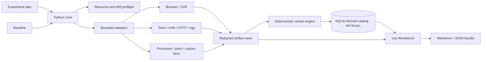

# 02. 架构与安全边界

## 1. 架构目标

首个实现必须在 16 GB Windows 开发机上形成完整纵向闭环，同时保持跨项目通用性。
架构优先级依次为：确定性裁决、证据可追溯、安全默认、资源有界、适配器扩展和界面体验。

## 2. 逻辑组件



### 2.1 Python Core

负责 CLI、本地 API、计划校验、运行状态机、资源预检、批次编排、适配器生命周期、
证据清单、哈希与确定性裁决。首个纵向切片优先使用已安装的 Python 运行时创建项目隔离环境，
具体最低版本和依赖在实现 ADR 中核验后锁定。

Core 同时维护变更范围与里程碑门禁：计划声明影响层级后，适配器可提供 diff、契约或运行
观察；若发现范围上浮，裁决引擎要求升级消费者矩阵和证据层，不能让 UI 静默忽略。

### 2.2 SQLite Metadata

目标架构中 SQLite 保存结构化计划、基线、运行、变量、断言、证据索引和审计事件，大文件
不进入数据库。M4 已冻结一个更窄的纵向切片：把已验证 Bundle 的 Run 摘要保存为可重建目录
快照，并通过只读本地 API 提供给工作台。数据库始终只是本地派生索引，不替代可导出的开放
格式证据包。

### 2.3 Artifact Store

按 Run 分目录保存原始与解析后证据，生成清单和 SHA-256。默认位于 Git 忽略目录；导出前
执行脱敏与敏感类型检查。证据不可静默覆盖，重采集生成新版本或新 Run。

### 2.4 Vue Workbench

M3 已实现只读证据工作台：从同源脱敏夹具或本地目录读取 Report、Evidence/Bundle Manifest、
Evidence JSON 和受支持截图，在显示前核对路径、大小、引用与 SHA-256，并呈现运行状态、裁决、
断言、证据索引及 Console/Network/视口/截图事实。UI 只展示生产者裁决，不在浏览器端另写规则；
本地目录只在内存中读取，不上传、不写回。

M4 在 M3 详情页之前增加了只读 Run 目录；M6/M7 后续补充了独立 Comparison 与
PairedAnalysis 本地验真。M8 已增加 BatchAnalysis 显式四文件入口，在显示前重算 Manifest、
BatchPlan seal、全因子矩阵、固定种子顺序、Analysis ID、slot/Profile/Run 引用和双状态；
计划编辑、在线执行时间线和报告发布仍是后续能力。

M5 已冻结一个更窄的编排切片：Core 内置的只读静态 HTTP 目标、Plan 0.4、编排证据和单一
`run` 入口。它只管理离线冻结的静态文件集合，不执行 Shell、外部进程、项目命令或中间件；
目标生命周期和异常清理已验证，但计划编辑、跨 Run 比较与完整自举仍未实现。

M9 已冻结 Plan 0.5 的单个可信 `ONESHOT`：ToolBindings 与只读 Preview 在本地解析普通 `.exe`，
用户批准精确 digest 后由 Windows Job Object 在无 Shell、无 stdin/TTY 边界内执行，并生成严格
`runtime.command`。M10 已冻结独立的 Windows 11/C1 长运行生命周期 Contract 0.2；合同不是实现事实。

### 2.5 Browser Adapter

使用 Playwright/CDP 采集真实浏览器步骤、Console、Network、截图和视口事实。认证材料只在
运行时内存中使用；Cookie、Authorization、请求体和响应体遵循默认拒绝或字段级脱敏策略。

### 2.6 Import Adapters

v0 优先支持通用开放格式和低风险只读输入，例如 JUnit XML、覆盖率摘要、HAR、JSON、
结构化日志和用户提供的断言结果。特定数据库、中间件和 CI 平台放在核心闭环之后。

## 3. 通用核心与项目适配器

核心可以理解：

- 实验、基线、变量、批次、负载、故障、资源、步骤、证据、断言和裁决；
- HTTP、浏览器、文件、进程、端口、时间序列和结构化事实；
- 可比较性、漂移、污染、随机种子和退出条件。

核心不理解：

- 订单、库存、支付、图书、用户等领域实体；
- RocketMQ、RabbitMQ、Nacos 等组件是“必须存在”的假设；
- 某个仓库的路径、启动脚本、端口或状态机。

这些差异由适配器、计划模板和命名断言提供。适配器失败不能修改核心裁决语义。

## 4. 命令执行边界

v0 不接受自由文本 Shell 命令。优先采用：

- 只读文件导入；
- 直接库/API 调用；
- 预定义适配器；
- 结构化可执行文件与参数数组；
- 显式工作目录、超时、环境允许列表和资源上限。

M9 已对一个可信 `ONESHOT` 实现完整程序、参数、目录、环境名称、限制与副作用边界的只读预览和
精确 digest 审批。M10 若进入实现，长运行服务仍必须使用独立 Profile、Preview、Job 所有权、
owned readiness 与逆序清理；拒绝 Shell 拼接、隐式变量展开和把凭据写入命令行。

## 5. 隐私与脱敏

- 默认不采集 Cookie、Authorization、Set-Cookie、密码字段、令牌、私钥和 `.env` 值；
- 默认将用户目录、账号、IP 和连接字符串归类为敏感字段；
- HAR 和日志在持久化前运行规则化脱敏，原始敏感证据不得进入普通导出包；
- 导入的 HTML 作为不可信数据渲染，禁止脚本执行；
- 本地 API 绑定回环地址，不提供默认局域网暴露；
- 报告记录“发生过脱敏”和规则版本，但不泄露被替换的原值。

## 6. 资源模型

- VeriTrail Core、UI、浏览器和被测系统分别记账，避免工具开销被误算为被测对象变化；
- 启动前记录总内存、可用内存、CPU、磁盘和必要端口；
- 计划声明软阈值、硬阈值、采样间隔、超限宽限期和中止策略；
- 默认串行执行重型步骤，受限微并行必须有显式上限；
- 超限时先停止升压、保存现场，再按逆序清理本轮资源；
- 具体阈值由机器与项目模板实测，不在核心中写死 16 GB 或固定进程数。

资源采样器应支持低开销模式和采样率记录。高敏感实验可以增加无采集或最小采集对照 Run，
估计观察者效应；若工具开销超出计划容差，结果不能生成无条件性能 `PASS`。

16 GB 是首个开发与自举环境，也是验证资源模型的参考约束；产品本身仍需适配其他容量。

## 7. 数据与裁决边界

- 证据是事实，断言是规则对事实的解释，Verdict 是版本化规则的输出；三者不得混存。
- UI、AI 和适配器都不能直接写入最终 `PASS/FAIL`。
- 人工补充必须作为有作者、时间、理由和证据引用的审计事件。
- 同一证据在新规则下重新裁决时保留旧结论和规则版本。
- 里程碑状态由证据推进，不能由路线图文字或手工勾选直接推进到 `FROZEN`。
- 后继里程碑的实现入口必须检查前置门禁，避免未闭环接口和状态机向后扩散。
- ExperimentPlan 首次执行前封存并哈希；影响语义的修改创建新版本，禁止回写已有 Run 的判定条件。
- Baseline 具有有效期与失效原因；过期基线保留历史价值，但不能参与新的有效裁决。

## 8. 计划目录结构

M0 已建立以下目录；尚未实现的目录不以空占位符进入仓库：

```text
VeriTrail/
  src/veritrail/ # Python package and CLI core
  schemas/       # versioned plan, evidence and report schemas
  examples/      # redacted deterministic examples
  tests/         # standard-library automated verification
  docs/          # product, model, architecture and acceptance
  artifacts/     # local runtime evidence, ignored by Git
```

M3 冻结后目录增加：

```text
VeriTrail/
  web/          # Vue/TypeScript/Vite 只读证据工作台与脱敏前端夹具
  scripts/      # 有界 M3 生产构建浏览器验收脚本
```

`adapters/` 尚未创建；M4 只新增 Catalog 派生索引，不建立通用 SQLite 元数据写模型。

M1 在 Core 内增加低开销资源采样和 `preflight` CLI，但不建立执行器：采样器只访问标准库
系统 API、输出卷、显式回环端口和输出父目录，不通过 Shell 枚举或控制机器。

M2 在 Python Core 内增加可选 Playwright Browser Adapter：它只接受 Plan 0.3 的回环 origin、
结构化步骤和串行视口，截图以二进制附件进入 Artifact Store。它不是通用命令执行器，也不会
管理被测站点生命周期、浏览器 Profile、远程认证或并行 Context。

M3 不增加生产者或数据库：Vue Workbench 直接只读消费 M0–M2 的开放证据包。演示请求和预览
服务只绑定回环，生产构建无 CDN、远程字体、遥测和第三方图片；故宫主题结构由 CSS 实现，
证据截图仍作为经过清单校验的数据展示。

M4 已把离线 Catalog 构建、只读 SQLite 快照、同源回环 API 和 Workbench Run 目录冻结为一条
纵向能力；Bundle 继续拥有事实权威。合同与运行证据见 `docs/08-m4-local-run-catalog.md`。

M5 把“外部手工启动轻量站点”设为控制组，并已冻结内置、固定回环、只读、无 Shell 的
静态目标适配器。合同、失败反例、运行证据和资源边界见
`docs/09-m5-bounded-run-orchestrator.md`。

M6 架构已冻结独立 Comparison Bundle，用于派生比较两个同 sealed Plan 的 Run；它不修改来源
Bundle/Verdict，也不改变 M4 Run-only Catalog。双 Python、真实三态、逐字节复建、生产与
Codex 内置浏览器、安全、资源和清理终验见
`docs/10-m6-deterministic-rerun-comparison.md`。

M7 已冻结独立 PairingPlan 与 PairedAnalysis：四角色固定顺序、跨 Plan 严格控制投影、
outcome 预期与负对照边界；Core/CLI 与 Workbench 已通过双 Python、真实三态、逐字节复建、
损坏来源与输出拒绝、Catalog 隔离、生产及 Codex 内置浏览器终验。合同与证据见
`docs/11-m7-preregistered-paired-analysis.md`。

M8 已冻结独立 BatchPlan、RunAssignment 与 BatchAnalysis：先串行完成 4–16 格全因子
Profile coverage，再用固定种子生成成员集合不变的 perturbation 顺序，并从不可变 Run 分开
判断覆盖、预注册假设和来源 Verdict。它不修改 ExperimentPlan 的单变量语义，也不执行项目
命令或真实并行；8 个独立 M5 Run 的真实 2×2 批次、生产 Workbench 浏览器终验与内置浏览器
人工键盘验收已经完成。合同与冻结证据见
`docs/12-m8-preregistered-batch-matrix.md`。

M9 已冻结 Plan 0.5、ToolBindings 0.1、CommandPreview 0.1、Windows Job Object trusted process
runner 与 `runtime.command`。M10 Contract 0.2 冻结独立 sealed ProjectProfile、Plan 0.6 和
`runtime.bootstrap` 的目标架构，但尚未实现；准确边界见
`docs/15-m10-bounded-project-bootstrap.md`。

## 9. 实现顺序

1. 计划/基线/变量/裁决模型与 JSON schema；
2. 一个 CLI 纵向切片：创建计划、导入证据、运行规则、导出报告；
3. 环境与资源预检、中止和污染检测；
4. 浏览器适配器及 Console/Network 证据；
5. Vue 工作台读取同一裁决结果；
6. M9 可信一次性命令；
7. M10 Windows/C1 有界完整项目自举；
8. M11 不同类型真实项目全链路；
9. M12 故宫主题前端终稿；
10. M13 系统思维与分层代码质量终审；
11. M14 整改后终局复验与发布收束。

不先堆适配器，不先做大屏，不先接 AI。
