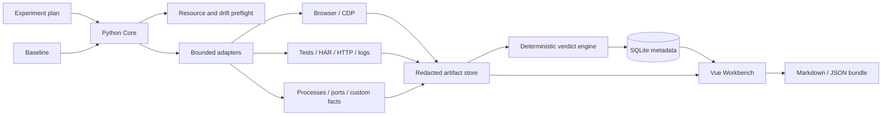

# 02. 架构与安全边界

## 1. 架构目标

首个实现必须在 16 GB Windows 开发机上形成完整纵向闭环，同时保持跨项目通用性。
架构优先级依次为：确定性裁决、证据可追溯、安全默认、资源有界、适配器扩展和界面体验。

## 2. 逻辑组件



### 2.1 Python Core

负责 CLI、本地 API、计划校验、运行状态机、资源预检、批次编排、适配器生命周期、
证据清单、哈希与确定性裁决。首个纵向切片优先使用已安装的 Python 运行时创建项目隔离环境，
具体最低版本和依赖在实现 ADR 中核验后锁定。

Core 同时维护变更范围与里程碑门禁：计划声明影响层级后，适配器可提供 diff、契约或运行
观察；若发现范围上浮，裁决引擎要求升级消费者矩阵和证据层，不能让 UI 静默忽略。

### 2.2 SQLite Metadata

保存结构化计划、基线、运行、变量、断言、证据索引和审计事件。大文件不进入数据库。
数据库是本地索引，不替代可导出的开放格式证据包。

### 2.3 Artifact Store

按 Run 分目录保存原始与解析后证据，生成清单和 SHA-256。默认位于 Git 忽略目录；导出前
执行脱敏与敏感类型检查。证据不可静默覆盖，重采集生成新版本或新 Run。

### 2.4 Vue Workbench

提供计划编辑、基线比较、批次矩阵、运行时间线、证据缺口、变量漂移、资源停止、
Console/Network 浏览、断言解释和报告导出。UI 只展示裁决结果，不在浏览器端另写一套规则。

### 2.5 Browser Adapter

使用 Playwright/CDP 采集真实浏览器步骤、Console、Network、截图和视口事实。认证材料只在
运行时内存中使用；Cookie、Authorization、请求体和响应体遵循默认拒绝或字段级脱敏策略。

### 2.6 Import Adapters

v0 优先支持通用开放格式和低风险只读输入，例如 JUnit XML、覆盖率摘要、HAR、JSON、
结构化日志和用户提供的断言结果。特定数据库、中间件和 CI 平台放在核心闭环之后。

## 3. 通用核心与项目适配器

核心可以理解：

- 实验、基线、变量、批次、负载、故障、资源、步骤、证据、断言和裁决；
- HTTP、浏览器、文件、进程、端口、时间序列和结构化事实；
- 可比较性、漂移、污染、随机种子和退出条件。

核心不理解：

- 订单、库存、支付、图书、用户等领域实体；
- RocketMQ、RabbitMQ、Nacos 等组件是“必须存在”的假设；
- 某个仓库的路径、启动脚本、端口或状态机。

这些差异由适配器、计划模板和命名断言提供。适配器失败不能修改核心裁决语义。

## 4. 命令执行边界

v0 不接受自由文本 Shell 命令。优先采用：

- 只读文件导入；
- 直接库/API 调用；
- 预定义适配器；
- 结构化可执行文件与参数数组；
- 显式工作目录、超时、环境允许列表和资源上限。

未来若允许项目命令，执行前必须展示完整程序、参数、目录、环境差异和预计副作用，并记录审计事实。
拒绝 Shell 拼接、隐式变量展开和把凭据写入命令行。

## 5. 隐私与脱敏

- 默认不采集 Cookie、Authorization、Set-Cookie、密码字段、令牌、私钥和 `.env` 值；
- 默认将用户目录、账号、IP 和连接字符串归类为敏感字段；
- HAR 和日志在持久化前运行规则化脱敏，原始敏感证据不得进入普通导出包；
- 导入的 HTML 作为不可信数据渲染，禁止脚本执行；
- 本地 API 绑定回环地址，不提供默认局域网暴露；
- 报告记录“发生过脱敏”和规则版本，但不泄露被替换的原值。

## 6. 资源模型

- VeriTrail Core、UI、浏览器和被测系统分别记账，避免工具开销被误算为被测对象变化；
- 启动前记录总内存、可用内存、CPU、磁盘和必要端口；
- 计划声明软阈值、硬阈值、采样间隔、超限宽限期和中止策略；
- 默认串行执行重型步骤，受限微并行必须有显式上限；
- 超限时先停止升压、保存现场，再按逆序清理本轮资源；
- 具体阈值由机器与项目模板实测，不在核心中写死 16 GB 或固定进程数。

资源采样器应支持低开销模式和采样率记录。高敏感实验可以增加无采集或最小采集对照 Run，
估计观察者效应；若工具开销超出计划容差，结果不能生成无条件性能 `PASS`。

16 GB 是首个开发与自举环境，也是验证资源模型的参考约束；产品本身仍需适配其他容量。

## 7. 数据与裁决边界

- 证据是事实，断言是规则对事实的解释，Verdict 是版本化规则的输出；三者不得混存。
- UI、AI 和适配器都不能直接写入最终 `PASS/FAIL`。
- 人工补充必须作为有作者、时间、理由和证据引用的审计事件。
- 同一证据在新规则下重新裁决时保留旧结论和规则版本。
- 里程碑状态由证据推进，不能由路线图文字或手工勾选直接推进到 `FROZEN`。
- 后继里程碑的实现入口必须检查前置门禁，避免未闭环接口和状态机向后扩散。
- ExperimentPlan 首次执行前封存并哈希；影响语义的修改创建新版本，禁止回写已有 Run 的判定条件。
- Baseline 具有有效期与失效原因；过期基线保留历史价值，但不能参与新的有效裁决。

## 8. 计划目录结构

M0 已建立以下目录；尚未实现的目录不以空占位符进入仓库：

```text
VeriTrail/
  src/veritrail/ # Python package and CLI core
  schemas/       # versioned plan, evidence and report schemas
  examples/      # redacted deterministic examples
  tests/         # standard-library automated verification
  docs/          # product, model, architecture and acceptance
  artifacts/     # local runtime evidence, ignored by Git
```

`web/`、`adapters/` 和 SQLite 元数据将在各自前置里程碑冻结后再创建。

## 9. 实现顺序

1. 计划/基线/变量/裁决模型与 JSON schema；
2. 一个 CLI 纵向切片：创建计划、导入证据、运行规则、导出报告；
3. 环境与资源预检、中止和污染检测；
4. 浏览器适配器及 Console/Network 证据；
5. Vue 工作台读取同一裁决结果；
6. 轻量前端自举案例；
7. 多 Context、真实后端与可选组件适配器；
8. 界面视觉收尾和公开演示。

不先堆适配器，不先做大屏，不先接 AI。
