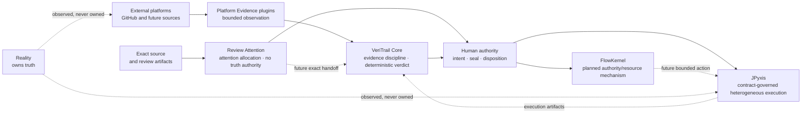

# VeriTrail 能力边界与系统认知地图 0.1

## 1. 文档身份

- 状态：`CAPABILITY_LEDGER_OPEN / DESIGN_SPACE_ONLY`；
- 决策：`NO_NEW_MILESTONE_COMMITTED / R1_CURRENT_PRIORITY`；
- 施工状态：`NO_LEDGER_ITEM_IMPLEMENTATION_STARTED`；
- 来源基线：`main@9ab64121350b69ce81e6be79961ad426026bbc39`；
- 影响等级：`L3_SYSTEM / DOCUMENTATION_ONLY / NON_NORMATIVE_MAP`；
- 本文不创建源码、Schema、CLI、CI、标签、Release 或空目录；
- 本文不重开 M0–M14、E 轨、P0–P4、PC 兼容桥、R0 或 Pattern Corpus 的冻结结论；
- 本文不替代正在独立形成的 R1 合同，也不改变 R1 的当前优先级。

文档编号 `114` 为本平行支线预留；`113` 已由独立 R1 合同候选使用。两条支线不互相继承未合入内容。

本文把仓库已经明确写下、但分散在里程碑“未证明/未实现”说明中的边界整理成一份开放账册。
它回答的是：**当前证明边界之外已经看见了什么，以及什么条件出现以后，它才有资格成为工程。**

它不是缺陷清单、欠债清单、版本承诺或隐藏路线图。

这里的 Capability Ledger 也不是 R 轨的不可变 Pattern Ledger。本文通过普通 Git 历史保留修订，
不创建 `record_digest`、追加式 Artifact Schema 或自动状态机；真正晋级仍须进入独立合同与证据闭环。

## 2. 先分清五种身份

```text
FROZEN_CAPABILITY
    已由对应合同、实现、证据和冻结坐标支持的能力

OBSERVED_BOUNDARY
    当前合同明确没有证明或没有实现的边界

CANDIDATE_DIRECTION
    出现真实需求后可以审议的方向

COMMITTED_MILESTONE
    已经获得明确合同入口、责任边界和施工授权的阶段

ARCHITECTURAL_NON_CLAIM
    系统主动不拥有的权力或不作出的声明
```

它们不能互相代替：

```text
OBSERVED_BOUNDARY != DEFECT
OBSERVED_BOUNDARY != CANDIDATE_DIRECTION
CANDIDATE_DIRECTION != COMMITTED_MILESTONE
NOT_IMPLEMENTED != TECHNICAL_DEBT
ARCHITECTURAL_NON_CLAIM != TODO
```

因此，`AI 裁决未实现` 不能被解释成“以后给 AI 增加 PASS/FAIL 权”；`P 插件 0.1.0` 也不能因为
版本号较小就被解释成“尚未完成”。二者分别是权威边界和首个有界能力。

## 3. 当前事实、当前施工与设计空间

### 3.1 当前已经成立的有界事实

VeriTrail 当前已经拥有多条可组合但身份独立的冻结能力：

```text
sealed Plan / Profile
    -> bounded execution and lifecycle
    -> Observation / Evidence
    -> deterministic Core evaluation
    -> immutable reports and read-only Workbench
```

P 轨另行把 GitHub API 与公共渲染事实压成标准 Evidence，并通过薄 handoff 交给 Core。GitHub 是
被观察的平台事实来源，不是 VeriTrail Verdict 的所有者；插件负责忠实采集，Core 只按 sealed
AcceptancePlan 复算。内部运行 Evidence 与外部平台 Evidence 都可以成为验收输入，但它们的来源、
身份和充分性不能混成一个“系统已证明”布尔值。

### 3.2 当前合法施工入口

R0 与首个 Pattern Corpus 已冻结，R1 双前置门已经解除。既有 R 轨 Plan 把 R1 的候选问题描述为：

```text
Exact SourceSnapshot
    -> deterministic CodeFacts
    -> typed semantic relations
    -> bounded overlapping ReviewSlices
    -> CoverageLedger
```

这段只标出当前问题方向，不替独立 R1 合同冻结 Schema、语言范围、关系类型、Slice identity 或
coverage 分母。R1 只建立确定性理解骨架，不进入 AI 提案、自动排序、HumanDisposition、Core Verdict
或自动修改。本能力账不与 R1 抢合同权，也不以“未来完全体”为理由提前创建后继实现。

### 3.3 上位设计空间，不是当前产品声明

若未来真实需求依次触发本账中的若干能力，VeriTrail 体系可能逐渐形成：

```text
Intent
    -> Bounded Execution
    -> Observation
    -> Evidence
    -> Review Attention
    -> Human Decision
    -> Deterministic Verification
```

这表达的是一种工作范式假设：人可以逐步从逐项操作的 `Human in the Execution Loop`，迁到负责
目标、授权边界、异常与最终签字的 `Human in the Authority Loop`。候选杠杆可以描述为：

```text
Verified Useful Work / Human Attention
```

但当前仓库没有冻结“完全体”、范式变化或杠杆提升数据。线性链也不是唯一运行路径：Core 验收可以
独立于 Review Attention 发生；HumanDisposition 与 Core Verdict 是不同 Artifact；任何一步缺证据都
必须保留 `PENDING / INCONCLUSIVE / PARTIAL / UNSUPPORTED`，不能为了故事完整而补出确定答案。

## 4. 体系职责地图



这张图只描述候选责任关系，不声明仓库之间已经集成：

| 对象 | 回答的问题 | 当前事实边界 | 不拥有 |
| --- | --- | --- | --- |
| VeriTrail Core | 给定 sealed Plan 与 Evidence，怎样确定性推导 Verdict | 已有冻结能力 | 世界真相、执行资源、人工处置 |
| GitHub Evidence Plugin | GitHub API 与公开页面实际观察到了什么 | P0–P4 首个有界插件已冻结 | Core Verdict、GitHub 真相、其他平台完整性 |
| Review Attention | 人应该优先看哪些有依据的源码切片 | R0/Corpus 已冻结；R1 是当前施工入口 | 缺陷真值、HumanDisposition、Core Verdict |
| [JPyxis](https://github.com/NoctilumeDev/JPyxis) | 异构计算怎样保持控制、定义、运行时与合同分权 | 独立仓库 M0–M6 单机基线已冻结 | VeriTrail Verdict、FlowKernel 权限、业务真相 |
| [FlowKernel](https://github.com/NoctilumeDev/FlowKernel) | 不可靠策略怎样在确定性权限、资源、隔离与恢复边界内提出有界动作 | 独立仓库仍为 Planned，R0 尚未关闭 | 当前可运行内核、外部验收真值、VeriTrail Verdict |
| Human authority | 选择前提、Seal、授权边界并承担最终处置责任 | 系统宪法中的权威边界 | 世界终极真相 |

更准确的关系不是“JPyxis、FlowKernel 都是 VeriTrail 插件”，而是：

```text
independent system
    -> immutable artifact / observation boundary
    -> replaceable Evidence adapter
    -> VeriTrail standard Evidence
```

事件和不可变制品可以跨界；状态所有权、凭据、执行入口和 Verdict 权不能跨界。

## 5. 能力域，而不是一张巨型 TODO

### 5.1 Product Surface

负责 Plan 起草、预览、Seal 前审查与只读/可写界面边界。它不能因为增加在线编辑就把 Workbench 变成
Verdict 所有者，也不能让 Plan drafter 自动获得 Seal authority。

### 5.2 Execution Platform

负责结构化工具链、服务、中间件、容器、拓扑、操作系统和隔离。通用 Shell、可信结构化命令与不可信
代码执行是三个不同安全问题；Docker 也不是恶意代码沙箱。

### 5.3 Experiment Engine

负责真实并行、统计推断与容量表征。它们依赖清楚的 workload、样本、独立性、停止规则、硬件、拓扑与
SLO 坐标，不能由“多跑几次”或“CI 很快”推出。

### 5.4 Evidence Ecosystem

负责 GitHub 之外的平台观察适配。新增平台需要新的来源语义、身份、匿名/认证边界和公开读回证据，
不能把 GitHub 0.1.0 当成通用平台能力。

### 5.5 Authority / Intelligence

负责智能解释、提案与人的注意力分配。AI judgment capability 可以成为候选 Provider；AI Verdict
authority 仍是明确的架构非声明，不能因“未实现”被提升成待办。

## 6. 开放能力账

### CAP-001 · Plan authoring 与 Workbench write path

- **能力域：** Product Surface；
- **当前身份：** `OBSERVED_BOUNDARY`；
- **已观察边界：** 当前 Workbench 是只读验真面，M3 没有证明计划编辑器或在线写；
- **为什么可能重要：** 降低结构化 Plan 起草、预览、Seal 前纠错与项目接入成本；
- **为什么现在不做：** R1 当前研究确定性源码语义，写路径不阻断 R1–R6；
- **触发条件：** 出现持续的真实作者工作流，证明离线文件起草已成为主要错误源或使用瓶颈；
- **晋级前证据：** draft/Seal 权威分离、并发与冲突模型、审计历史、恢复路径、负向权限测试；
- **不表示：** Workbench 当前有缺陷，也不表示在线编辑可以改变既有 Verdict；
- **候选归属：** `UNASSIGNED`。

### CAP-002 · 结构化构建与包管理器适配

- **能力域：** Execution Platform；
- **当前身份：** `CANDIDATE_DIRECTION`；
- **已观察边界：** M9/M10 只证明结构化、预览摘要批准的可信命令，不接受自由 Shell 或完整 npm/Maven 生命周期；
- **为什么可能重要：** 让真实 Java/JavaScript 项目在可声明参数与生命周期内被构建和验收；
- **为什么现在不做：** 需要先区分工具 capability、命令 authority 与项目输入，不能用一个 Shell 字符串绕过合同；
- **触发条件：** 至少一个真实消费方无法由现有可信命令/Profile 有界表达；
- **晋级前证据：** typed command contract、allowlist/operand identity、secret boundary、timeout/cleanup、失败保留与干净复现；
- **不表示：** 任意 Shell、TTY、stdin、网络安装或不可信代码已经获准；
- **候选归属：** `UNASSIGNED`。

### CAP-003 · 服务与中间件生命周期

- **能力域：** Execution Platform；
- **当前身份：** `CANDIDATE_DIRECTION`；
- **已观察边界：** M10/M11 只冻结有界 C1 节点与单应用真实链，没有通用数据库、消息队列或中间件所有权；
- **为什么可能重要：** 支持需要数据库、缓存、队列或多服务依赖的真实验收对象；
- **为什么现在不做：** readiness、数据初始化、事实所有权、逆序回收和残留恢复都不能由“进程启动成功”替代；
- **触发条件：** 出现不能用静态外部依赖或现有 C1 Profile 表达的真实闭环；
- **晋级前证据：** per-service owner、readiness、data seed/provenance、teardown、crash recovery、残留检测与负向矩阵；
- **不表示：** Docker 是必需实现，也不表示服务成功等于业务事实成立；
- **候选归属：** `UNASSIGNED`。

### CAP-004 · Container lifecycle

- **能力域：** Execution Platform；
- **当前身份：** `OBSERVED_BOUNDARY`；
- **已观察边界：** M0–M14 没有冻结 Docker/容器生命周期；
- **为什么可能重要：** 为可复现环境、服务组合与依赖分发提供候选载体；
- **为什么现在不做：** 容器是部署与资源能力，不自动解决状态所有权、数据真实性、跨平台或恶意代码隔离；
- **触发条件：** 真实消费方证明容器比现有本地 Profile 更能降低环境漂移且成本可控；
- **晋级前证据：** image digest、runtime/version、network/volume ownership、secret policy、cleanup、download provenance 与离线/干净复现；
- **不表示：** 容器等于沙箱，也不表示 C2/C3 必须依赖 Docker；
- **候选归属：** `UNASSIGNED`。

### CAP-005 · C2/C3 与多服务拓扑

- **能力域：** Execution Platform；
- **当前身份：** `OBSERVED_BOUNDARY`；
- **已观察边界：** 当前冻结能力集中在 Windows/C1 和有界单应用链；
- **为什么可能重要：** 表达多角色、多实例、动态依赖和跨节点失败传播；
- **为什么现在不做：** 节点数量上升会同时扩大 pairing、时间窗口、部分失败、重试、数据与回收语义；
- **触发条件：** 出现有明确所有者、拓扑和验收条件的真实 C2/C3 Subject；
- **晋级前证据：** topology identity、per-node lifecycle、cross-node correlation、partial failure、global budget 与 recovery matrix；
- **不表示：** 当前 C1 证明可外推到多节点，也不把“同时启动”冒充分布式正确性；
- **候选归属：** `UNASSIGNED`。

### CAP-006 · Cross-platform execution

- **能力域：** Execution Platform；
- **当前身份：** `OBSERVED_BOUNDARY`；
- **已观察边界：** 进程、listener owner 与 Job Object 的冻结事实是 Windows 特定语义；
- **为什么可能重要：** 让 Linux/macOS 等消费方获得各自真实的生命周期和资源证据；
- **为什么现在不做：** 跨平台不是删除 `win32` 判断；每个平台都需要独立所有权、信号、进程树与资源语义；
- **触发条件：** 出现真实非 Windows 消费方或维护环境；
- **晋级前证据：** platform profile、process ownership、signal/exit semantics、port attribution、cleanup 与干净机器矩阵；
- **不表示：** 当前 Windows 实现有 bug，也不表示各平台必须拥有相同底层机制；
- **候选归属：** `UNASSIGNED`。

### CAP-007 · Untrusted execution isolation

- **能力域：** Execution Platform / Authority；
- **当前身份：** `OBSERVED_BOUNDARY`，并受独立安全门约束；
- **已观察边界：** Windows Job、资源上限、容器候选和可信命令均不构成恶意代码沙箱；
- **为什么可能重要：** 若未来允许未知第三方代码或 Agent 生成物直接执行，需要限制真实世界影响半径；
- **为什么现在不做：** 这是独立威胁模型、隔离机制和旁路验证问题，不能作为普通 adapter 补丁加入；
- **触发条件：** 项目明确选择把不可信执行纳入产品身份，并接受相应安全与维护成本；
- **晋级前证据：** threat model、trust root、escape/side-channel 边界、network/filesystem/device policy、kill/recovery 与独立攻击验证；
- **不表示：** Docker、Job Object 或低权限账户已经满足隔离要求；
- **候选归属：** `UNASSIGNED`。

### CAP-008 · Wave 内真实微并行

- **能力域：** Experiment Engine；
- **当前身份：** `OBSERVED_BOUNDARY`；
- **已观察边界：** M8 的 `runtime_overlap_claim=NOT_PROVEN`；现有 wave/Assignment 语义不能证明运行时重叠；
- **为什么可能重要：** 提高有界实验吞吐，并研究共享资源下的交互效应；
- **为什么现在不做：** 并行会改变总预算、取消、资源竞争、Evidence pairing 与失败归因；
- **触发条件：** 串行成本成为已测瓶颈，且真实 workload 需要同窗重叠而不是简单批处理；
- **晋级前证据：** overlap clock、shared absolute budget、cancellation propagation、resource contention、deterministic ledger 与残留清理；
- **不表示：** Assignment 并行、线程存在或吞吐提高就证明真实并行正确；
- **候选归属：** `UNASSIGNED`。

### CAP-009 · Statistical inference

- **能力域：** Experiment Engine；
- **当前身份：** `CANDIDATE_DIRECTION`；
- **已观察边界：** M7/M8 没有证明统计显著性或一般因果结论；
- **为什么可能重要：** 当单变量复验不足以描述噪声 workload 时，提供有前提的效应估计；
- **为什么现在不做：** 没有 sample model、独立性、effect size、stopping rule 与 multiple-testing 规则时，统计输出只会制造更强错觉；
- **触发条件：** 出现稳定、可重复采样且确实需要概率推断的真实实验；
- **晋级前证据：** preregistered estimand、sampling model、power/effect、stopping rule、missing-data 与复算 fixture；
- **不表示：** 增加 `p < 0.05` 就得到因果或生产结论；
- **候选归属：** `UNASSIGNED`。

### CAP-010 · Capacity characterization

- **能力域：** Experiment Engine；
- **当前身份：** `CANDIDATE_DIRECTION`；
- **已观察边界：** 当前没有生产容量结论；
- **为什么可能重要：** 为特定硬件、拓扑、workload 与 SLO 提供可复验的容量范围；
- **为什么现在不做：** 没有精确坐标时，“支持多少并发”不是稳定命题；
- **触发条件：** 出现真实部署决策，需要容量证据而非功能正确性证据；
- **晋级前证据：** workload/version、hardware/topology、warmup、duration、SLO、failure profile、statistical method 与重复实验；
- **不表示：** 单机基线、CI 时长或一次压测可以外推成 production capacity；
- **候选归属：** `UNASSIGNED`。

### CAP-011 · Additional platform Evidence adapters

- **能力域：** Evidence Ecosystem；
- **当前身份：** `CANDIDATE_DIRECTION`；
- **已观察边界：** P0–P4 只冻结 GitHub API/Public Render 首个插件；
- **为什么可能重要：** 从其他代码托管、制品、CI/CD 或部署平台取得独立来源事实；
- **为什么现在不做：** 每个平台的身份、信任域、公开渲染和失败语义不同，不能复制 GitHub 字段后声称通用；
- **触发条件：** R 轨或真实项目出现 GitHub Evidence 无法回答的 sealed claim；
- **晋级前证据：** platform contract、read-only permission、source identity、rate/retry policy、anonymous/auth boundary、real public slice 与 Core handoff；
- **不表示：** GitHub 0.1.0 未完成，也不表示多个 API 的成功自动构成完整现实；
- **候选归属：** `UNASSIGNED`。

### CAP-012 · AI/Rule AttentionProposal Provider

- **能力域：** Authority / Intelligence；
- **当前身份：** `CANDIDATE_DIRECTION`，已在既有 R3/R4 路线中分配问题位置，但尚未取得当前施工权；
- **已观察边界：** R3 可以研究 AI/规则怎样提出有依据的 AttentionProposal，R4 仍由人产生 HumanDisposition；
- **为什么可能重要：** 把大规模机器产物压缩成有限、高价值且可追溯的人工审查入口；
- **为什么现在不做：** R1/R2 的确定性事实、关系、覆盖和分析证据尚未建立；
- **触发条件：** 仅按已冻结 R1–R6 阶段门推进；
- **晋级前证据：** exact SourceSnapshot binding、provider identity、supporting/opposing evidence、coverage、stale semantics、human disposition trace；
- **不表示：** AI 拥有缺陷真值、Seal、HumanDisposition、仓库写权限或 Core Verdict；
- **候选归属：** `R3 / R4` 已有阶段边界。

## 7. 明确不进入候选队列的权力

以下项目不是因为“还没时间”而未实现，而是当前架构主动不授予：

| Boundary ID | 非声明 | 原因 |
| --- | --- | --- |
| AUTH-001 | AI 自动产生 Core `PASS/FAIL` | Core 只按 sealed Plan 与 Evidence 确定性推导；AI 最多提出解释或 AttentionProposal |
| AUTH-002 | Workbench 重新裁决或改写历史 Verdict | Workbench 是只读验真面，展示不拥有事实 |
| AUTH-003 | Provider 成功推出 coverage 完整或“无问题” | Success、completeness 与 truth 是三个不同命题 |
| AUTH-004 | Docker/Job Object/资源上限推出恶意代码安全 | 资源控制、生命周期所有权与不可信隔离不是同一能力 |
| AUTH-005 | 人承担最终责任成为 Provider 质量免责 | Provider 仍须对来源错绑、越权、误报、漏报与覆盖谎言负责 |

若未来要改变其中任何一条，必须先重开对应宪法与权威合同；不能通过实现便利、配置开关或新插件
静默获得权力。

## 8. 候选之间的关系

这些候选不是一条固定流水线：

```text
Plan authoring
    可以独立演进，但必须先守住 drafter / seal authority

Structured toolchain
    可以为 service lifecycle 提供能力，不自动获得自由 Shell 权

Service lifecycle
    可以运行在本机或容器，不以 Docker 为必要前提

Container lifecycle
    可以改善环境分发，不自动证明跨平台或不可信隔离

C2/C3 topology
    依赖显式节点所有权与全局预算，不等于“多启动几个进程”

Cross-platform
    需要平台特定机制证据，不以统一实现细节为目标

Real overlap
    可独立于 C2/C3 研究，但必须重新证明预算、取消和归因

Statistics / capacity
    只在真实 workload 与问题定义出现后启动

Additional Evidence adapters
    由 sealed claim 的信息缺口触发，不由插件数量目标触发
```

`Untrusted execution isolation` 是横切安全边界，不应被藏在 Shell、Docker、C2/C3 或跨平台实现内部。
R1–R6 当前也不依赖上述未分配候选；提前施工只会扩大证明表面积。

## 9. 晋级门

一条能力只有同时具备以下信息，才可从开放账进入 `CONTRACT_CANDIDATE`：

1. 一个不能由现有冻结能力满足的真实消费方或可复验反例；
2. 精确问题命题与明确 non-goals；
3. authority、owner、consumer 与 state ownership；
4. 输入、输出、Artifact identity 与失败语义；
5. 资源、权限、数据与恢复边界；
6. 与现有 Core、P、R 轨及外部仓库的单向依赖关系；
7. 最小单变量证明切片与停止线；
8. 干净环境、负向矩阵和公开读回方案；
9. 明确的退出条件，以及若证据不成立时的拒绝/收缩路径。

晋级仍不等于实现授权。只有后继独立合同冻结并建立 exact main 施工基线后，才可以写代码。

## 10. 当前裁决

```text
M0–M14                         FROZEN
P0–P4                          FROZEN
R0 + Pattern Corpus 0.1        FROZEN
R1                             CURRENT PRIORITY

Capability Ledger              OPEN
New capability milestone       NOT COMMITTED
“Complete system” claim         NOT PROVEN
Ledger-item implementation     NOT STARTED
```

因此下一步仍然是回到独立 R1 合同，由它决定确定性 SourceSnapshot、CodeFact、关系、Slice 与
coverage 的精确边界；合同冻结以前仍不写实现。本账只负责让未来方向不再遗忘、不互相冒充，也不因为
“地图上有路”就替项目决定必须走哪条路。
