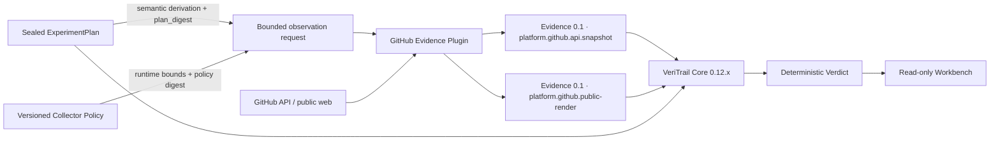

# Post-Core 平台证据插件 Plan v1

> 状态：`P0_FROZEN / DESIGN_ONLY / P1_NOT_STARTED`
>
> 基线：`VeriTrail Core 0.12.2`；M0–M14、E0–E3 与全部既有发布坐标保持只读
>
> 影响层级：独立平台插件产品线；Core、Starter、Authoring Skill 与 Workbench 均不修改

## 1. 为什么另开 P 轨

GitHub 上的提交、分支、Pull Request、状态检查、Release、Pages 和公开渲染，是被验收系统之外的
平台事实。它们不属于 M0–M14 Core 的历史实现，也不属于 E0–E3 的合同填写入口。如果把这类能力
继续记为 M15，Core 的冻结历史会被误解为重新施工；如果塞进入口层，Starter 又会获得不属于它的
远端观测责任。

因此新增独立 `P`（Platform Plugin）轨：

```text
M0–M14  Core 冻结历史
E0–E3   Starter / Authoring 入口层
P0–Pn   平台证据插件产品线
```

`P` 只表示平台插件阶段，不表示 Core 后继里程碑。三个轨道共享证据方法，不共享版本号、标签、
实现目录或状态推进权。

## 2. 产品分层



依赖箭头只能向内：插件依赖公开的 Evidence 合同，Core 不导入插件，Workbench 不重写插件事实，
插件也不调用 Core 私有函数。将来即使移除 GitHub 插件，Core、Starter 和 Workbench 仍须完整运行。

## 3. 所有权

| 层 | 唯一职责 | 明确不负责 |
| --- | --- | --- |
| Claim owner / Seal authority | 提出问题、选择前提、定义目标，并最终决定是否 Seal | 把个人判断宣布为现实真相、把 Seal 权隐式转交给起草者、回写已封存标准 |
| Human / AI Plan drafter | 把已声明目标起草成可评审 Plan，暴露歧义、反例与未决项 | 因为起草了 Plan 就自动 Seal、替提出者改题或取得最终决定权 |
| 执行 Agent | 在授权边界内忠实质疑、规划和执行，并报告观察到的前提冲突 | 擅自改写目标、扩大权限或宣布观点终极正确 |
| GitHub | 仓库、提交、PR、检查、Release、Pages 与公开页面在平台上对外暴露的远端状态 | VeriTrail 计划、断言、裁决或现实真相 |
| GitHub Evidence Plugin | 有界只读采集、字段白名单、来源与错误记录、Evidence 生成 | 修改 GitHub、生成 `PASS/FAIL`、替用户选择期望坐标 |
| VeriTrail Core | Evidence 校验、断言执行、ExecutionStatus 与 Verdict | 猜测 GitHub 语义、在插件失败时伪造事实 |
| Workbench | 只读展示已验证产物 | 浏览器端采集、二次裁决或修正事实 |

“采集者观察到了什么”与“谁有资格确认结论”必须分开。插件可以报告一个 check run 的
`conclusion=success`，但只有 sealed Plan 中的规则才能判断它是不是所需检查、是不是绑定了正确提交、
是否足以支持项目结论。

这里的 API 与公开页面是 GitHub 同一权威下的两个观察面，可以暴露交付漂移，却不是相互独立的第三方
见证。sealed Plan 固定验收期望并派生观察坐标；独立的 versioned Collector Policy 只提供 API 版本、
超时和重试等运行边界。request 同时绑定二者的 digest，但 Policy 不能携带通过条件。插件记录观察，
Core 检查规则。Plan digest 证明内容绑定，不认证批准人的现实身份；任何一层都
不能单独证明坐标封存前的
源码、数据或结果真实。P 轨只承诺其支持范围内的“承诺后完整性与一致性”，不承诺“承诺前真实性”；
GitHub 之外的独立见证、可信时间锚或来源真实性网络也不进入 P0–P4 产品路线。

同样，sealed Plan 拥有声明与验收条件，不拥有世界真相。插件与 Core 不裁定提出者的观点是否正确，
只保留声明、观察平台事实并按既定规则推导 Verdict；现实模糊、冲突或不可判时必须保留不确定性，
不得由插件、Core 或 AI 替世界补出确定答案。Agent 发现与前提冲突的证据时必须忠实报告并把 Seal
决定权交还给人，不能借“前提由人负责”保持沉默，也不能自行改题。

## 4. 固定实施顺序

### P0：架构、合同与评审冻结

P0 只允许：

- 本 Plan；
- [GitHub Evidence Plugin 0.1 合同](78-github-evidence-plugin-contract.md)；
- [P0 架构评审与冻结事实](79-p0-github-plugin-design-review.md)；
- README、里程碑索引与项目指令中的分轨说明。

P0 不创建包、目录、CLI、Schema、工作流、测试夹具、标签或 Release，不调用远端写接口。

### P1：结构化 GitHub API 事实

P1 才允许建立独立包，并只实现首个纵向切片：

```text
exact owner/repository + exact target commit + sealed plan_digest
  -> repository/default branch
  -> pull request/merge coordinate
  -> required check identities and observed check runs
  -> release/tag/assets
  -> Pages deployment metadata when applicable
  -> normalized API Evidence 0.1
```

Observation Request 不拥有独立 `expected.*` 语义，只描述从 sealed Plan 按版本化规则机械派生的“去
哪里看、看什么”，以及 Collector Policy 给出的非语义运行边界；P1 必须在联网前用实际 Plan 和 Policy
分别重算比对，不能只相信 digest 字符串。现有 ExperimentPlan 能否无歧义承载 GitHub 坐标也必须先由
Plan-to-request 映射夹具证明；若需要自由文本私约或 Core Schema 变更，停止 P1 并另立兼容合同。

观察规格摘要、Collector Policy 摘要与 request envelope seal 必须分开：前者只由观察规格版本、规范化
坐标和投影标识“观察什么”，第二个标识有界运行策略，最后一个标识单次请求。`facts_digest` 再独立
标识“在同一观察规格和规范化语义下得到的事实内容”；现有 EvidenceArtifact SHA-256 则标识包含
来源、策略、请求实例和采集元数据的具体
证据文件。两次采集可以拥有相同 `facts_digest`，却必须拥有不同的 Evidence artifact identity。任何一层
都不得把 request ID、本地时间或非语义超时策略混入事实身份，避免把“换了一次请求”误报成“平台事实
发生漂移”。

`plan_digest` 与派生规则版本由 request envelope 独立绑定，用来证明观察规格的来源，不能进入
`observation_spec_digest`。否则只改 Plan 中与观察无关的文字或断言，也会错误改变 observation/fact
identity。两个 Plan revision 派生出相同观察规格时，spec/fact identity 可以稳定，request 与 Evidence
artifact identity 仍保持不同。

原始 API/客户端/解析器版本属于采集 provenance；只有会改变规范化含义的
`normalization_semantics_version` 才进入 `facts_digest`。实现版本变了但规范化语义与事实未变时，事实
身份可以保持不变，具体 Evidence 产物仍应因 provenance 不同而保持可区分。换言之：

```text
Same Fact != Same Observation != Same Request
Fact Identity != Evidence Artifact Identity != Execution Identity
```

required check 的显示名不是唯一身份；P1 必须尽可能保留 producer/app、workflow/job 与来源类型。一次
Evidence 由多次 GitHub 调用组成时，还必须保存每个 probe 的观察时间、实际操作数与总采集窗口，且不
得把组合结果描述成 GitHub 的原子快照。

首片默认匿名读取公开仓库；可选凭据必须只从运行时内存进入，且权限不超过所需只读范围。

### P2：公开渲染证据

P2 在全新、未登录的浏览器 Context 中读取公开 README、Release 或 Pages 页面，记录最终 URL、HTTP
状态、可见标记、链接目标和内容签名。API 事实与浏览器事实是同一平台下独立记录的两个观察面，
不能互相冒充，也不能被计成两个独立权威。

### P3：Core handoff 与真实正负链

P3 才把插件产物交给 sealed Plan，跑通至少一条完整正向链和多条漂移负链，证明：

```text
local success
  != branch pushed
  != PR gates satisfied
  != main merged
  != public rendering current
```

插件仍不输出 Verdict；Core 必须能把缺证据、证据冲突和真实不变量失败分开。

### P4：独立发布与公共读回

只有 P0–P3 的合同与真实证据全部满足后，才能决定是否发布。若发布，版本、标签和资产必须独立，
候选命名为 `github-evidence-v0.1.0`；它不得移动 `v0.12.x`、Starter 或 Authoring Skill 标签，也不得
成为仓库 Latest Core Release。

## 5. 阶段隔离

| 阶段 | 可修改 | 不可修改 | 出口 |
| --- | --- | --- | --- |
| P0 | 文档与索引 | 所有运行代码、Schema、CI、发布坐标 | 设计一致性与停止线冻结 |
| P1 | 独立插件包、插件测试、脱敏夹具 | Core 私有实现、浏览器采集、远端写能力 | API 事实正负链 |
| P2 | 插件内公开浏览器采集器 | 登录态 Profile、Core Browser Adapter 语义 | API/渲染双源边界 |
| P3 | 插件 handoff、计划示例、真实验收产物 | 插件裁决、Workbench 新规则 | Core 确定性裁决闭环 |
| P4 | 独立版本、标签、Release、下载读回 | 历史标签与既有 Release | 公开可复现坐标 |

前一阶段没有达到出口，后一阶段不得先建空壳或“顺手实现”。组内可以形成高内聚，组间只通过版本化
合同连接；不得用共享全局状态、跨包私有导入或条件分支把耦合藏起来。

## 6. 版本与兼容性

- Core 继续按 `0.12.x` 维护；P 轨不能把插件能力写成 Core 已发布事实。
- 插件未来独立使用 SemVer；P0 阶段没有可安装版本。
- 插件首个兼容窗口只能声明经过真实验证的 Core 范围，不提前承诺未来 Core。
- GitHub REST API 请求必须显式固定受支持 API 版本；升级 API 版本属于采集合同变更并重新跑插件矩阵。
  API/解析器实现版本默认进入 provenance；只有规范化含义改变时才同时升级事实语义版本。
- GitHub Enterprise、GraphQL、webhook、定时监控和多平台抽象均不属于首个版本。

## 7. P0 停止线

P0 完成只证明“施工边界已定义”，不证明插件存在。进入 P1 前必须同时满足：

1. 权威、依赖、权限、数据、失败与清理边界无歧义；
2. API 与真实浏览器的证据职责分开；
3. Evidence、ExecutionStatus、Verdict 没有被压成一个插件状态；
4. 正负验收矩阵覆盖错提交、错门禁、未合并、发布漂移和公开渲染漂移；
5. 信任上限明确区分一致性、来源真实性与现实真实性，并声明 GitHub API/公开页面的共同故障域；
6. 认识论上限明确区分 Verification Correctness 与 Specification Correctness，并保留未知、冲突与不可判；
7. GitHub 之外的独立锚明确保持为产品非目标，没有被偷渡进后继阶段；
8. Core 0.12.2、M0–M14、E0–E3 以及全部标签均未移动；
9. 文档通过链接、空白、敏感信息与历史口径检查；
10. P0 设计经受保护主线合入并完成公开读回。
11. request、fact、Evidence artifact 与 Core execution 的身份定义互不替代，且没有自引用摘要。

在这些条件满足前，只能继续修正文档，不能进入 P1。
