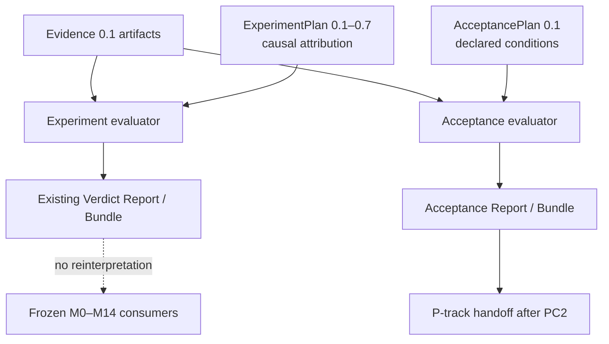

# Post-P0 Core 兼容桥合同 0.1：AcceptancePlan 与跨 Evidence 关系

> 状态：`PC0_FROZEN / PC1_IMPLEMENTED_NOT_FROZEN / P1_NOT_STARTED`
>
> 日期：`2026-09-05`
>
> 设计基线：`VeriTrail Core 0.12.2` 与 P0 collection semantics 合并提交
> `352ea611f7f7d349d9b9b61c0f68cc07b34c0743`
>
> PC0 原始变更：只修改文档；未创建 Schema、运行代码、CLI、插件、CI、标签或 Release
>
> 未来影响层级：`L2_CONTRACT + L3_SYSTEM`；全部既有消费者必须进入兼容矩阵
>
> 后续事实：PC1 平台无关实现候选见
> [`81-pc1-acceptance-core-implementation.md`](81-pc1-acceptance-core-implementation.md)。本文其余
> “PC1 必须实现”等措辞保留为 PC0 冻结合同原文，不表示 PC2 已完成或 P1 已启动。

## 1. 为什么需要兼容桥

P0 离线探针已经留下两个不能靠文案绕过的事实：

1. 现有 `ExperimentPlan` 可以被塞入 GitHub 字面坐标，却仍要求 baseline、唯一 PRIMARY、random seed
   和 load model；即使 PRIMARY 从未被任何 Evidence 观察，Core 0.12.2 仍可能得到 `PASS`。
2. 现有 Assertion 只能把一个 Evidence 中的一个 JSON Pointer 与 literal expected 比较，不能表达
   “API Evidence 与 Render Evidence 的动态 session 值必须相同”。

这不是 GitHub Collector 的局部缺口，而是 Core 公共语义缺口。若先写 Collector，只能出现三种错误：

- 为通过 `SINGLE_VARIABLE` Schema 编造实验字段；
- 在插件中预计算 `*_passed`、`*_match` 或 `*_is_correct`，偷走 Core 的裁决权；
- 依赖私有比较器配对两份 Evidence，使 Bundle 无法被独立复算。

因此在 P1 之前增加一次临时、串行的 **Platform Compatibility（PC）桥**：

```text
P0  GitHub plugin design frozen
  -> PC0  public compatibility contract
  -> PC1  generic Core implementation
  -> PC2  backward-compatibility and runtime freeze
  -> P1   Structured GitHub API Collector
```

`PC` 不是 M15、E4，也不是第四条长期产品线。它只关闭 P0 与 P1 之间已经被真实探针证明存在的公共
语义缺口；PC2 完成后即停止扩张。

## 2. 当前实现审计

### 2.1 `ExperimentPlan` 是因果合同，不是通用验收外壳

Core 0.12.2 的公开实现同时要求：

```text
experiment_type = SINGLE_VARIABLE
exactly one PRIMARY variable
baseline
random_seed
load_model
```

并且后续 Plan 版本继续增加 preflight、browser、target、command 或 bootstrap 的阶段专用约束。它们都
服务于“改变了什么、是否可归因”的实验语义。远端平台验收回答的是“指定坐标当前是否满足预先声明的
条件”，不天然存在一个被操纵的 PRIMARY、一个比较 baseline 或一个负载模型。

所以本合同拒绝：

- 把平台坐标解释成 PRIMARY variable；
- 用空负载、占位 baseline 或固定随机种子满足字段形状；
- 把 `ExperimentPlan` 再升为一个同时兼容因果实验和非因果验收的万能 0.8；
- 通过把字段全部改成 optional 来换取表面兼容。

### 2.2 旧消费者已经依赖因果字段

当前消费者不是只看 `plan_id`：

| 消费者 | 已有依赖 | 本合同裁决 |
| --- | --- | --- |
| `plan.py` | baseline、PRIMARY、random seed、load model、版本专用字段 | 原语义不改 |
| `verdict.py` | variable contamination、baseline validity、阶段专用 contamination | 不接收 AcceptancePlan |
| `reporting.py` | 抽取唯一 PRIMARY，并固定输出 baseline/random seed/load model | 不复用旧 Report producer |
| Comparison | 比较同 sealed ExperimentPlan、PRIMARY、baseline 与 random seed | 明确拒绝 AcceptancePlan |
| Pairing / Batch | 依赖 PRIMARY 角色、处理值和因果投影 | 明确拒绝 AcceptancePlan |
| Catalog | 从 `sealed-plan.json` 重验 ExperimentPlan 与旧 Report | PC1 不宣称支持 |
| Workbench | 展示旧 Report 的因果适用边界 | PC1 不宣称支持 |
| Starter / Authoring Skill | 生成并验证 Plan 0.6/0.7 草案 | 不自动生成 AcceptancePlan |
| Bootstrap / Browser / Command | 绑定具体 ExperimentPlan 版本与生命周期 | 明确拒绝 AcceptancePlan |

在旧 Plan 上加入一个分支字段并不能消除这些依赖，只会把耦合藏进 `if plan_kind`。兼容方案必须让旧
入口默认继续走旧代码路径，新入口显式进入新合同。

## 3. 核心裁决：建立并列的 `AcceptancePlan 0.1`

`AcceptancePlan` 是新的 Core 公共合同，专门表达**非因果、预注册、证据驱动的验收问题**。它与
`ExperimentPlan` 并列，不继承、不替代、不重新解释后者。



两条路径可以共享 canonical JSON、SHA-256、Evidence importer、JSON Pointer 和确定性 operator 的内部
基础函数，但不能共享一个含义模糊的 Plan/Report 对象。共享实现不等于共享权威。

### 3.1 文档类型分派

`AcceptancePlan 0.1` 必须显式包含：

```text
plan_kind = ACCEPTANCE
schema_version = 0.1
```

分派规则固定为：

```text
plan_kind absent        -> legacy ExperimentPlan validator
plan_kind = ACCEPTANCE  -> AcceptancePlan validator
any other value         -> reject
```

不得按“有哪些字段”猜类型，也不得在读取旧 Plan 时注入默认 `plan_kind`。旧 Plan 的 canonical bytes、
seal digest、Bundle 和标签因此不发生变化。

### 3.2 最小合同形状

下面是 PC1 必须实现的语义形状，不是本轮已经存在的 JSON Schema：

```json
{
  "plan_kind": "ACCEPTANCE",
  "schema_version": "0.1",
  "plan_id": "github-release-readback",
  "version": 1,
  "subject": {
    "id": "repository-release",
    "version": "exact-declared-coordinate",
    "source_ref": "public-contract-reference"
  },
  "question": "Do the retained platform observations satisfy the declared delivery coordinates?",
  "governance": {
    "claim_owner_ref": "declared-claim-owner",
    "drafter_ref": "declared-plan-drafter",
    "seal_authority_ref": "declared-seal-authority",
    "seal_decision": "CONFIRMED"
  },
  "observation_specs": [],
  "evidence_requirements": [],
  "sufficiency_rules": [],
  "integrity_rules": [],
  "assertions": [],
  "resource_budget": {},
  "change_scope": {},
  "reproduction_steps": [],
  "cleanup_steps": [],
  "seal": {}
}
```

明确不存在的字段：

```text
baseline
experiment_type
variables
random_seed
load_model
preflight / browser / target / command / bootstrap_profile
```

需要这些因果或生命周期语义时，应使用对应 `ExperimentPlan`，不能把它们重新塞回
`AcceptancePlan`。

### 3.3 治理字段的能力上限

`governance` 只把 claim owner、drafter 与 Seal authority 的**声明引用**分开。它可以证明这些引用与
Plan 字节一起被封存，不能证明现实身份、授权链或签名真实。

- `seal_decision` 只有 `CONFIRMED` 的草案才能被封存；
- `drafter_ref` 等于 `seal_authority_ref` 可以被允许，但两个角色字段仍不能合并；
- AI 或 Human 起草不自动取得 Seal 权；
- Plan digest 仍是内容绑定，不是身份认证；
- 认证、电子签名和组织审批系统不进入 PC0–PC2。

## 4. Observation Spec 与 Evidence 绑定

### 4.1 Observation Spec 是“观察什么”

每个 `observation_specs[]` 至少包含：

```text
id                         Plan 内局部引用，不属于事实身份
contract.id                公开适配合同标识
contract.version           适配合同版本
evidence_type              预期 Evidence 类型
coordinates                由该公开合同定义的有限结构化坐标
projections                由该公开合同定义的有限字段投影标识
canonicalization_profile   veritrail-json-c14n/1
```

Core 只理解公共 envelope、有限 JSON 和 digest 规则，不理解 `owner/repository`、PR、Tag、Pages 或其他
平台领域字段。PC1 的 Core validator 只验证 contract 引用结构完整、版本显式，以及
`coordinates` / `projections` 可按冻结 profile 规范化；这不证明对应 adapter 已安装，也不证明领域字段
可执行。Plan 可以在保留未知能力引用的前提下被封存，但不能因此启动 adapter 或采集。

sealed Plan 中实际保存的 `coordinates` 与 `projections` 就是 spec digest 的语义输入。Core 只对这些已
封存值做 canonical JSON，不做平台领域归一化；adapter 只能验证其已经符合公开合同，不能在 Seal 后
替换大小写、补默认值、排序或改写坐标。若 adapter 所需 canonical form 不同，只能拒绝并形成新 Plan
revision，不能让“Plan 中的坐标”和“实际请求坐标”成为两份事实。

进入 P1 后，插件必须在任何 I/O 前按它公开、版本化的 adapter contract 验证 contract id/version、
`coordinates` 与 `projections`；未知合同、未知 projection 或字段不合法时 fail closed，不发起 probe，
也不回退到相似合同。这个校验权不允许插件修改 Plan、补写期望或把“不支持”伪装成一次失败观察。

`observation_spec_digest` 对下列投影计算：

```text
canonicalization_profile
contract.id + contract.version
evidence_type
sealed coordinates canonical bytes
sealed projections canonical bytes
```

它排除 Plan 内 `id`、整个 `plan_digest`、drafter/authority、question、assertion、request、Collector
Policy 与运行时间。于是只改 Plan 说明或局部引用名，不会伪造“观察的问题发生了变化”；整个 Plan seal
仍会如实变化。

### 4.2 Evidence Requirement 是“本 Run 需要哪份产物”

`evidence_requirements[]` 使用 Plan 内 ID 引用一个 Observation Spec。0.1 只允许：

```text
cardinality = EXACTLY_ONE
```

Core 依据以下三个操作数解析产物：

```text
evidence_type
metadata.veritrail_observation.observation_spec_digest
metadata.veritrail_observation.plan_digest
```

裁决规则：

| 观察 | 结果 |
| --- | --- |
| 没有候选 Evidence | requirement missing，后续通常 `PENDING` |
| 有同类型 Evidence，但 Plan/spec binding 不同 | `OBSERVATION_BINDING_MISMATCH / INCONCLUSIVE` |
| 两份或更多 Evidence 同时满足一个 `EXACTLY_ONE` requirement | `OBSERVATION_CARDINALITY_CONFLICT / INCONCLUSIVE` |
| 同一 Evidence 被两个 requirement 重复消费 | 0.1 拒绝，`INCONCLUSIVE` |
| 精确一份类型、Plan 与 spec 均匹配 | requirement resolved |

不能选择“第一份”“最后一份”“最近一次”或同目录文件作为隐式绑定。

### 4.3 Core-owned observation metadata

为了让不同插件通过同一公共入口被 Core 绑定，PC1 必须在现有 Evidence 0.1 的开放 `metadata` 中验证
一个具名子合同：

```json
{
  "metadata": {
    "veritrail_observation": {
      "schema_version": "0.1",
      "canonicalization_profile": "veritrail-json-c14n/1",
      "plan_digest": "<sealed AcceptancePlan digest>",
      "observation_spec_digest": "<semantic observation digest>",
      "request_seal_digest": "<specific request envelope digest>",
      "collection_session_id": "<new identity per execution>",
      "collector_role": "<stable role>",
      "coverage": "COMPLETE|PARTIAL|ERROR|NOT_APPLICABLE",
      "normalization_semantics_version": "<version>",
      "facts_digest": "<normalized fact identity>"
    }
  }
}
```

该块只提供绑定、provenance、coverage 与事实身份，不保存 token、Cookie、Authorization、账号秘密、
原始响应体或可信时间主张。插件可以在 `facts` / `metadata` 中保留更多公开合同允许的来源与 probe
细节，但不得重复创建第二份相互竞争的 Plan/spec/session 权威。

`plan_digest`、request、session 与采集实现版本仍不进入 `facts_digest`。两个 Plan revision 可以派生
相同 spec 并观察到相同 facts；它们的 `observation_spec_digest` / `facts_digest` 可相同，request、
Evidence artifact SHA-256 与 Core execution identity 仍不同。

`facts_digest` 由公开 adapter contract 的 normalization semantics 定义和产生。通用 Core 验证其格式、
把它与 Evidence 一起保留，并依据实际 `facts` 操作数裁决；Core 在不认识领域投影时不得假装已经独立
重算该 digest。需要重算时必须调用公开、版本化的 adapter conformance 能力，并把成功或缺失保持为
独立 integrity 事实；digest 字符串本身不是 Verdict，也不替代 Evidence artifact SHA-256。

## 5. 三类规则不能压成一种状态

平台验收至少存在三种性质不同的问题：

1. 证据是否足够；
2. 证据之间是否可被当作同一组可靠输入；
3. 有效证据是否满足目标条件。

因此 `AcceptancePlan` 分开保存：

| 规则集合 | 回答 | false / error 的最大语义 |
| --- | --- | --- |
| `sufficiency_rules` | 适用事实是否足够进入结论 | 缺口可见；若无已证明反例则 `PENDING` |
| `integrity_rules` | Evidence 绑定、session、来源或操作数能否共同使用 | `INCONCLUSIVE`；不能改写成目标 `FAIL` |
| `assertions` | 已绑定事实是否满足预注册验收条件 | decisive false 可 `FAIL` |

例如：

- `coverage == COMPLETE` 是 sufficiency；
- API 与 Render 的 `collection_session_id` 相等是 integrity；
- API commit 与 Plan 中的 exact commit 相等是 assertion；
- API 可见 commit 与公开链接目标相等是跨 Evidence assertion。

把 session mismatch 写成 HARD assertion 会错误得到“产品失败”；把 wrong commit 写成 integrity 又会
把真实反例降级为“不可归因”。两个数组必须保持不同权威。

### 5.1 统一 operand，而不是统一结论

三类规则使用同一个确定性 operand 形状：

```json
{
  "requirement_id": "api-evidence",
  "path": "/facts/commit/sha"
}
```

右操作数只能是：

```text
literal value
or
another { requirement_id, path }
```

首个 operator 集合为：

```text
eq / ne / lt / lte / gt / gte / contains / exists
set_equals / contains_all
```

运算语义固定为：

- JSON Pointer 使用 RFC 6901；`eq/ne` 类型严格，不做 string/number/boolean coercion；
- `lt/lte/gt/gte` 只接受整数，boolean 不视为整数；
- `exists` 是一元运算，right operand 必须缺失；requirement 已绑定但终端路径不存在时明确得到 false，
  requirement 本身未绑定时才是 `NOT_EVALUATED`；
- `contains` 只接受 string/string 或 array/单一 JSON value；数组元素以 canonical JSON bytes 比较；
- `set_equals` 与 `contains_all` 只接受数组，元素以 canonical JSON bytes 比较；任一侧存在 canonical
  重复元素时得到 rule error，而不是静默去重。

首片不接受脚本、表达式语言、Python callback、正则执行、JMESPath、SQL 或插件私有函数。

### 5.2 结果必须保留操作数

每条规则结果至少保存：

```text
rule id and category
operator
left/right resolved values after producer redaction
left/right EvidenceArtifact SHA-256
status
explanation
```

不能只保存 `matches=true`。跨 Evidence 关系必须能从封存 Plan 和原 Evidence 独立复算。

## 6. Acceptance Verdict 0.1

`ExecutionStatus` 继续沿用现有五态，但新的 Acceptance evaluator 不运行 causal contamination 逻辑，
也不读取 baseline 或 PRIMARY。裁决顺序固定为：

1. observation binding 歧义、cardinality 冲突、integrity false 或 rule error -> `INCONCLUSIVE`；
2. 没有上述 blocker，且至少一条 decisive assertion 由已绑定操作数明确否定 -> `FAIL`；
3. 否则，execution 未完成、requirement 缺失、sufficiency 未满足或 decisive assertion 未求值 ->
   `PENDING`；
4. required Evidence 唯一绑定、全部 integrity/sufficiency 通过、全部 decisive assertion 通过 -> `PASS`。

该顺序允许“另一个 probe 超时，但 wrong commit 已由有效证据明确证明”得到 `FAIL`；如果两份 Evidence
本身跨 session 错配，则完整结论先被 `INCONCLUSIVE` 阻断。`ERROR` 仍是 ExecutionStatus 或采集覆盖，
不会自动映射成 `FAIL`。

`OBSERVATION` 与 `OBJECTIVE` 继续不能覆盖 decisive 结果。`DEGRADATION_BOUNDARY` 仍属于 decisive，
但具体允许边界必须在 Plan 中显式表达，不能由展示层解释。

## 7. Plan、request、fact、Evidence 与 execution 身份

PC0 继续沿用 P0 已冻结的身份分层：

```text
AcceptancePlan digest
    owns declared conditions and observation specs

Observation spec digest
    owns what is observed

Request seal digest
    owns one bounded request envelope derived from Plan + Collector Policy

Collection session id
    owns one actual coordinated collection attempt

Facts digest
    owns normalized semantic facts under one spec + normalization semantics

EvidenceArtifact SHA-256
    owns one retained redacted Evidence document

Core execution identity
    owns one acceptance evaluation attempt
```

相等关系仍为：

```text
Same Fact != Same Observation != Same Request
Fact Identity != Evidence Artifact Identity != Execution Identity
```

Observation Request 不能包含独立 `expected.*`。GitHub P1 的 derivation 必须把
`AcceptancePlan.observation_specs[]` 机械投影到 request，并把整个 `plan_digest` 作为来源 binding；
Plan 中的 literal expected 与 relation assertion 不进入 request 或 Collector Policy。

## 8. 新产物与旧消费者隔离

PC1 必须建立独立公共产物：

```text
AcceptancePlan 0.1
AcceptanceReport 0.1
AcceptanceBundle 0.1
```

首片建议使用显式入口：

```text
veritrail acceptance-seal
veritrail acceptance-evaluate
```

现有 `seal`、`evaluate`、`preflight`、`browser-capture`、`run`、`compare`、`pair` 和 `batch` 的输入语义
不变。不得在旧 CLI 中按字段猜类型，也不得让旧 Report 填入虚假的 `primary_variable`、baseline、
random seed 或 load model。

PC1/PC2 不自动承诺：

- 旧 Catalog 已能索引 AcceptanceBundle；
- 旧 Workbench 已能展示 AcceptanceReport；
- Comparison、Pairing 或 Batch 已能分析 Acceptance Run；
- Starter/Authoring Skill 已能生成 AcceptancePlan；
- GitHub Collector 已存在。

这些消费者若将来需要支持，必须分别枚举数据所有者、失败边界与迁移测试；在此之前应明确拒绝，
不能把“文件是 JSON”当作兼容。

## 9. 向后兼容不变量

PC1/PC2 必须同时证明：

1. ExperimentPlan 0.1–0.7 的 validator、seal、canonical bytes 与 digest 逐字节不变；
2. 历史 Bundle、Comparison、Pairing、Batch、Catalog 和 Workbench 仍按原语义读回；
3. M0–M14、E0–E3、`v0.12.0`、`v0.12.1`、`v0.12.2` 及入口层标签不移动；
4. `plan_kind` 缺失只表示 legacy ExperimentPlan，不被回写进旧文件；
5. `plan_kind=ACCEPTANCE` 不能被 `validate_plan`、旧 `evaluate` 或旧分析器误收；
6. AcceptancePlan 不接受 ExperimentPlan 的因果与生命周期字段；
7. Evidence 0.1 顶层 Schema 不因 PC1 被改写；只有
   `metadata.veritrail_observation` 在 Acceptance evaluator 中获得新公共语义；
8. Core 共用底层函数不允许让 Acceptance 逻辑反向改变 causal Verdict 优先级；
9. 新能力版本只在代码、双 Python、负例、Bundle 和真实复算事实完成后决定；PC0 不预写版本号或标签。

## 10. PC1/PC2 负例矩阵

实现至少严格串行证明：

1. 旧 0.1–0.7 代表 Plan 的 seal/digest 与 0.12.2 基线一致；
2. 旧 Plan 加 `plan_kind` 被旧 validator 拒绝，不发生默认迁移；
3. AcceptancePlan 缺 `plan_kind`、未知 kind、含 baseline/variables/random seed/load model 时拒绝；
4. PC1 对缺失或畸形 contract 引用、非有限 JSON 和浮点拒绝；结构合法但 Core 未知的 adapter 引用
   可以被封存，但不得因此产生“已支持”或“可采集”的声明；
5. 只改 Plan question、governance 或局部 spec ID：Plan digest 变化，spec digest 不变；
6. 只改 coordinates/projections/contract semantic version：spec digest 与 Plan digest 均变化；
7. 没有 requirement Evidence -> `PENDING`；
8. 同类型但错误 Plan/spec binding -> `INCONCLUSIVE`；
9. 两份 Evidence 满足 `EXACTLY_ONE` -> `INCONCLUSIVE`；
10. 一份 Evidence 被两个 requirement 复用 -> `INCONCLUSIVE`；
11. 单 Evidence literal assertion 正向 -> `PASS`；明确 wrong coordinate -> `FAIL`；
12. API/Render 同 request、不同 session 的 integrity relation -> `INCONCLUSIVE`；
13. 同 session、跨 Evidence target relation 相等 -> `PASS`；不相等 -> `FAIL`；
14. 非 `exists` operand path 缺失 -> `NOT_EVALUATED`，若无其他决定性反例则 `PENDING`；`exists` 对已
    绑定 Evidence 的终端路径缺失明确为 false；
15. operator 类型不兼容或 canonical duplicate set -> rule error / `INCONCLUSIVE`；
16. `coverage=ERROR` 且没有目标事实 -> `PENDING`，不是 `FAIL`；
17. 一条已证明 decisive false 与一个无关缺口并存 -> `FAIL`；若同时存在 integrity blocker ->
    `INCONCLUSIVE`；
18. Assertion result 保留两侧值、路径与精确 Evidence SHA，不能只有布尔值；
19. 插件产物中出现 `all_required_checks_passed`、`api_render_match` 或私有 Verdict 字段不能被模板或
    Core 当作正式断言来源；
20. Compare/Pair/Batch、Bootstrap、旧 Catalog/Workbench 对 AcceptanceBundle 明确拒绝或标记不支持，
    不崩溃、不误读、不宣称已支持；
21. Core 全量普通/优化模式、Starter/Skill、Workbench 与现有真实验收基线无回归；
22. token、Authorization、Cookie、个人路径、原始响应体与本地生成物不进入 Git diff 或公开夹具。

每个负例只改变一个预注册变量；不能用一份混合失败同时冒充多个合同已证明。

P1 与 PC2 的交接还必须增加 adapter conformance 负例：未知 contract/version、未定义 projection 或
领域字段在任何 I/O 前拒绝且不得回退。该用例属于 P1 Collector 的实现门，不得提前伪装成 PC1 已有
运行能力。

## 11. 分阶段施工边界

### PC0：合同

只允许本文件与 README、AGENTS、P0 文档和里程碑索引的同步说明。出口为：

- 非因果 Plan、三类规则、Evidence binding、Verdict 与旧消费者边界无歧义；
- 文档链接、空白、敏感信息、历史坐标与无运行代码变化检查通过；
- 经受保护 `main` 合入并完成公开 README/本文读回。

### PC1：通用 Core 实现

只允许实现独立 AcceptancePlan/AcceptanceReport/AcceptanceBundle Schema、validator/seal、公共
observation metadata validator、operand/rule evaluator、产物构建和显式 CLI。PC1：

- 不创建 GitHub 插件包；
- 不联网；
- 不修改旧 Plan/Report Schema；
- 不接 Catalog、Workbench、Starter、Comparison、Pairing 或 Batch；
- 不发布版本。

### PC2：兼容与冻结

从 PC1 的新候选严格串行完成双 Python、普通/优化、旧 Plan digest、全 Core、Starter/Skill、Workbench、
新 Acceptance 正负 Bundle、逐字节复算、敏感信息和清理门禁。必须冻结一个精确可寻址 Core commit；
是否形成新 Core Release 只能依据完成后的发布合同决定，PC0 不预判。

PC2 未达到 `FROZEN` 前，P1 继续保持 `P1_NOT_STARTED`。P1 开始后也只能消费 PC2 冻结的公共合同，
不能导入 Core 私有符号。

## 12. 明确延期

PC0–PC2 不包含：

- GitHub API/浏览器 Collector、真实远端请求或平台修复；
- 通用插件注册中心、动态安装或跨平台统一 SPI；
- 任意 predicate/脚本语言、模糊匹配或插件 callback 裁决；
- 多对多 Evidence join、`EXACTLY_ONE` 以外 cardinality；
- Acceptance Run 的 Comparison/Pairing/Batch、Catalog 或 Workbench；
- Seal authority 身份认证、电子签名、外部时间锚或世界真相判断；
- Codex Security 深扫、攻击路径分析与极端环境攻击。

这些延期不是遗漏。兼容桥只需要证明一件事：

> 非因果验收可以在不伪造实验语义、不泄漏插件裁决权、也不改写既有因果基线的前提下，由 Core
> 对字面事实与跨 Evidence 关系做确定性裁决。

## 13. PC0 停止线

在以下条件全部满足前，不得进入 PC1：

1. 本合同已从最新受保护主线建立，没有继承本地历史补丁；
2. `AcceptancePlan` 与 `ExperimentPlan` 的所有权和分派无歧义；
3. sufficiency / integrity / assertion 的失败语义没有混用；
4. requirement 使用 spec digest 与 exact cardinality，不依赖顺序、目录或“最新”；
5. 跨 Evidence 操作数由 Core 解析，并保留原值与 artifact SHA；
6. Plan/request/fact/Evidence/execution 身份继续分层；
7. consumer matrix 与二十二项负例完整；
8. 文档没有宣称 Schema、CLI、插件、网络、兼容性或发布已经实现；
9. 本轮只包含文档和索引变化；
10. 受保护 `main` 合入和公开渲染读回完成。

任一项未满足时保持 `PC1_IMPLEMENTATION_NOT_STARTED / P1_NOT_STARTED`，继续修合同，不以临时代码
绕过。
